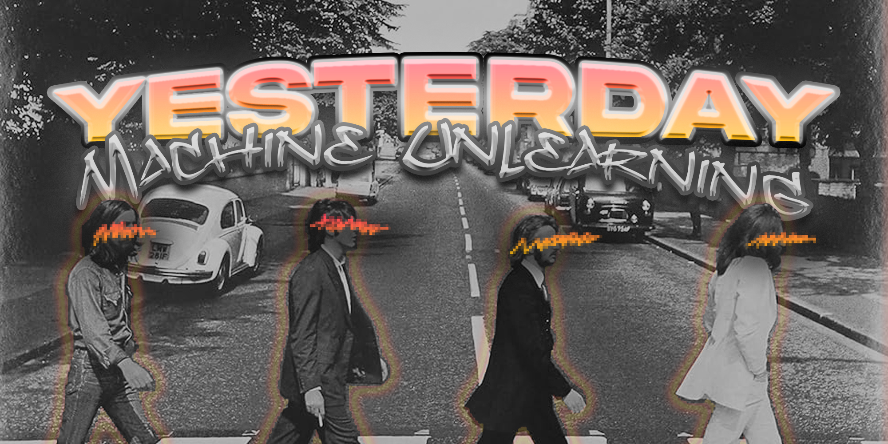

### Yesterday (Machine Unlearning)

This project explores the concept of machine unlearning, starting with examples on classification models and extending to generative models, such as Large Language Models (LLMs), image generators, and audio generators. Inspired by the film "Yesterday," where the protagonist awakens in a world without the Beatles, this project investigates the impact and methodologies for effectively 'erasing' learned data from AI models. The project aims to develop techniques that can selectively remove specific data from trained models without affecting overall performance. This is particularly relevant in scenarios where data privacy and compliance with regulations such as GDPR are critical.

[
