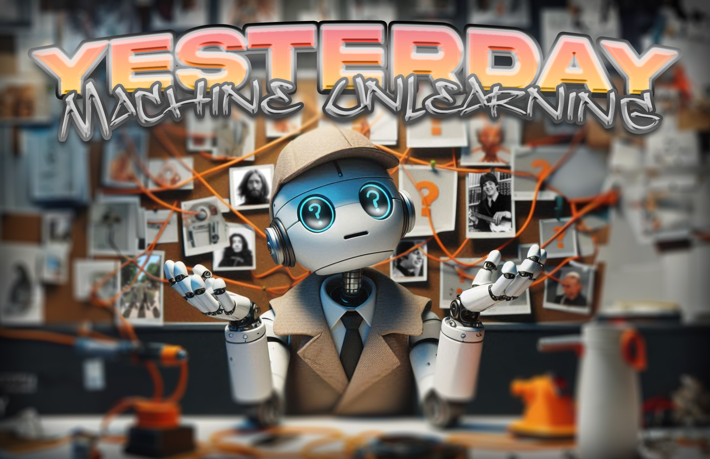

### Yesterday (Machine Unlearning)

This project investigates the idea of machine unlearning. It begins with examples on classification models and moves on to generative models like 🖼️ picture generators or Large Language Models (LLMs). Motivated by the scene in the movie Yesterday where the lead character wakes up in a Beatles-less world, this research explores the effects and techniques of successfully 'erasing' learned data from artificial intelligence models. The goal of the project is to create methods for removing particular data from trained models in a targeted manner without compromising overall performance. This is especially important in situations where maintaining data privacy and adhering to laws like the GDPR are crucial.

